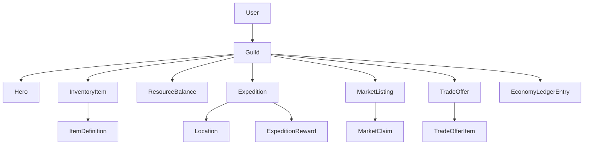

# MVP-спецификация браузерной idle/management RPG

## 1. Vision и короткий концепт

### Рабочее название
**Guild Exchange**

### Позиционирование
Браузерная idle/management RPG про управление маленькой гильдией авантюристов, где игрок не микроконтролит бой каждую секунду, а собирает состав, отправляет группы в экспедиции, перерабатывает добычу в полезные ресурсы и активно взаимодействует с другими игроками через рынок и сделки.

### Core fantasy игрока
Игрок чувствует себя не героем-персонажем, а владельцем и диспетчером гильдии: нанимает бойцов, экипирует их, выбирает риск экспедиций, извлекает прибыль из добычи и ищет выгодные сделки с другими игроками.

### Core gameplay loop
1. Игрок собирает группу из 3 героев.
2. Отправляет группу в асинхронную экспедицию на выбранную локацию.
3. Через заданное время получает золото, материалы, предметы, опыт аккаунта и шанс редкого дропа.
4. Решает, что делать с результатом:
   - усилить текущий состав экипировкой
   - переработать материалы в крафт-компоненты
   - выставить находки на рынок
   - обменять лишнее через приватную сделку
5. Улучшает гильдию, открывает новые слоты, более опасные зоны и доступ к более выгодной экономике.

### Прогрессия
- **Аккаунт гильдии**: основной уровень прогрессии, открывает новые локации, функции гильдии и лимиты торговли.
- **Герои**: имеют класс, редкость, уровень и экипировку.
- **Экономика**: игрок растёт не только силой, но и эффективностью оборота ресурсов.
- **Инфраструктура гильдии**: простые улучшения, повышающие лимиты или качество экспедиций.

### Роль игрока
- менеджер состава
- оператор экспедиций
- экономический участник рынка
- переговорщик в приватных сделках

### Session pattern
- **Короткие сессии 3–10 минут**: собрать награды, переэкипировать, выставить лоты, принять или отклонить сделки.
- **Возврат несколько раз в день**: перезапуск экспедиций и работа с рынком.
- **Асинхронное участие**: прогресс идёт между сессиями, а рынок и обмены создают причины заходить чаще.

## 2. Scope MVP для первого релиза

### Игровой scope MVP
1. Регистрация и вход.
2. Одна гильдия на аккаунт.
3. Стартовый набор из 3 героев фиксированных архетипов.
4. 3–4 PvE-локации с разной длительностью и таблицами наград.
5. Асинхронные экспедиции без ручного боя.
6. Инвентарь аккаунта.
7. Несколько слотов экипировки на героя.
8. Простая система предметов:
   - оружие
   - броня
   - аксессуар
   - ресурсы
   - редкие трофеи
9. Один базовый крафт/переработка:
   - объединение ресурсов в улучшенный материал
   - либо простая починка/апгрейд экипировки
10. Аккаунтный уровень гильдии и разблокировка новых зон.
11. Асинхронный рынок между игроками.
12. Приватный трейдинг между игроками.
13. Ограниченные прямые передачи ресурсов или предметов в строго урезанном виде.
14. Журнал экономических событий и сделок для поддержки и антиабуза.

### Почему такой scope реалистичен
- Нет real-time боя, PvP, гильдий и сложных симуляций.
- Большая часть ценности строится на таблицах наград, правилах доступа и обороте предметов.
- Экономика создаёт глубину даже при ограниченном количестве PvE-контента.
- SQLite подходит для малой нагрузки и простых асинхронных транзакций при аккуратных ограничениях.

## 3. Что сознательно НЕ входит в MVP

### Игровые системы вне MVP
- real-time бой
- полноценные рейды и кооперативные инстансы
- открытый PvP
- кланы, гильдии игроков, войны гильдий
- живая аукционная ставка с перебиванием в реальном времени
- сложное дерево талантов героев
- процедурная генерация героев со множеством статов
- сезонные события
- чат, почта, friends list, личные сообщения
- продвинутая система крафта с рецептами и профессиями
- внутриигровые NPC-магазины со сложной динамикой цен
- мобильные push-механики
- оффлайн-боевой лог с детальным реплеем

### Технические вещи вне MVP
- микросервисная архитектура
- отдельный job queue broker
- websocket-first live-обновления
- полноценная антифрод-система по устройствам и fingerprinting
- sharding, Redis, внешняя очередь

## 4. Social-first механики MVP

### Механика 1. Асинхронный рынок с фиксированной ценой
Игрок выставляет предмет или стек ресурса на общий рынок по фиксированной цене. Другой игрок может выкупить лот мгновенно.

**Плюсы**
- самый понятный UX
- легко реализовать на Next.js + Prisma + SQLite
- быстро даёт игрокам ощущение живой экономики
- проще балансировать, чем торги

**Минусы**
- меньше драматургии, чем в торгах
- возможны схемы перелива через дешёвые лоты

### Механика 2. Приватный трейдинг игрок-игрок
Один игрок создаёт конкретное предложение другому: отдаёт предметы и ресурсы, запрашивает встречный набор, получатель подтверждает или отклоняет.

**Плюсы**
- сильное чувство социального взаимодействия
- удобно для адресных обменов и помощи знакомым
- хорошо работает для редких предметов

**Минусы**
- выше риск абуза и перелива
- больше edge cases вокруг блокировок и отмен

### Механика 3. Прямые подарки или переводы
Игрок просто отправляет предмет или валюту другому без встречного шага.

**Плюсы**
- очень простой UX
- помогает дружеским взаимодействиям

**Минусы**
- самый высокий риск мультиаккаунтинга и перелива
- легко ломает прогрессию новичков
- плохо контролируется в MVP

### Выбор базовой механики MVP
**Базовая механика MVP — асинхронный рынок с фиксированной ценой.**

### Обоснование выбора
- это самый прагматичный центр экономики для первого релиза
- рынок создаёт массовое взаимодействие даже при маленьком онлайне
- он не требует совпадения игроков по времени
- правила покупки и расчётов проще транзакционно защищать через Prisma
- на него удобно наслаивать приватный трейд как вторичный канал

### Роль остальных механик в MVP
- **Приватный трейдинг входит в MVP**, но как ограниченный канал редких адресных обменов.
- **Прямые подарки не входят в полноценном виде**. Допускается только очень ограниченная форма, например передача малых объёмов базовых ресурсов между аккаунтами, достигшими минимального прогресса, но предпочтительнее вообще отложить до post-MVP.

## 5. Детализация аукциона/рынка для MVP

### Формат рынка
- Только **фиксированная цена**, без торга и без ставок.
- Только **один продавец, один покупатель**.
- Лот покупается целиком.
- Частичный выкуп стека не поддерживается в MVP.

### Что можно выставлять
- продаваемые ресурсы
- не-привязанные предметы экипировки
- редкие трофеи

### Что нельзя выставлять
- стартовые предметы
- bound-предметы
- предметы, надетые на героя
- предметы из активной сделки
- предметы из активной экспедиции или зарезервированные другой операцией

### Параметры лота
- продавец
- тип товара
- itemDefinition или resourceType
- количество
- цена в золоте
- комиссия создания
- срок жизни
- статус

### Правила создания лота
- игрок оплачивает небольшую невозвратную комиссию за публикацию
- цена ограничена нижним и верхним порогом по типу предмета или глобальными лимитами
- один аккаунт имеет лимит активных лотов
- один и тот же предмет нельзя выставить, если он уже где-то зарезервирован

### Длительность лота
- один фиксированный срок для MVP: например 12 или 24 часа
- разные типы сроков не нужны

### Комиссии
- **Listing fee**: маленькая невозвратная комиссия при выставлении
- **Sale tax**: процент удерживается с успешной продажи

Комбинация из двух комиссий нужна как золотой sink и как простая защита от спама и фейковых лотов.

### Отмена лота
- продавец может отменить некупленный лот
- listing fee не возвращается
- товар возвращается в инвентарь
- отмена недоступна, если одновременно идёт операция покупки

### Выкуп лота
- покупка проходит атомарно
- проверяется, что у покупателя хватает золота и слот всё ещё активен
- золото списывается у покупателя
- продавцу начисляется выручка за минусом налога
- товар перемещается покупателю
- лот переходит в состояние SOLD

### Истечение срока
- по окончании срока лот становится EXPIRED
- товар возвращается во внутреннее хранилище возврата или напрямую в инвентарь, если это безопасно

### Упрощение для MVP
Чтобы избежать проблем с переполнением инвентаря, лучше использовать **Market Claim Box**:
- непроданный лот после истечения попадает в claim box продавца
- деньги с продажи тоже могут приходить в claim box
- игрок вручную забирает результаты

Это упрощает обработку edge cases и снижает риск частично завершённых операций.

### Защита от спама и манипуляций
- лимит активных лотов на аккаунт
- лимит количества созданных лотов за период
- минимальный уровень гильдии для открытия рынка
- запрет продажи стартовых и bound-предметов
- ценовые коридоры на старте проекта
- журнал подозрительных сделок
- cooldown после регистрации до доступа к торговле

### Серые схемы через рынок и упрощённые защиты
- **перелив через дешёвые лоты** → минимальный уровень торговли, пороги цены, лимит на редкие предметы
- **скупка новичков** → базовые предметы новичков нельзя передавать и продавать
- **инфляция** → комиссии, sink-апгрейды, контролируемый дроп золота
- **отмыв через завышенные цены** → верхние лимиты цен на MVP

## 6. Детализация приватного трейдинга для MVP

### Модель взаимодействия
1. Игрок A выбирает игрока B по имени аккаунта или guild tag.
2. Формирует предложение:
   - что отдаёт
   - что хочет взамен
3. Система валидирует, что оба набора доступны и допустимы.
4. Предложение уходит в статус PENDING.
5. Игрок B может принять или отклонить.
6. При принятии обмен проводится атомарно.

### Что можно обменивать
- не-bound экипировку
- ресурсы
- трофеи
- золото в строго лимитированном объёме или вообще без него

### Рекомендуемое упрощение для MVP
Разрешить в приватной сделке:
- предметы и ресурсы
- **без прямой передачи золота**

Это резко уменьшает серые схемы и делает приватный трейд каналом бартерных обменов, а рынок — каналом денежной экономики.

### Ограничения приватного трейда
- доступ только после минимального уровня гильдии
- аккаунт должен быть старше минимального срока
- суточный лимит на количество завершённых сделок
- лимит на число активных предложений
- нельзя торговать bound- и starter-предметами
- нельзя торговать предметами выше определённого уровня редкости в первой версии, если это нужно для баланса
- нельзя принять трейд, если хотя бы один объект уже изменил состояние

### Подтверждение
Для MVP достаточно одношагового подтверждения со стороны получателя, если при создании предложения предметы отправителя уже резервируются.

### Защита от абуза
- резервирование предметов на время PENDING
- срок жизни оффера, после которого резерв снимается
- журнал всех предложений и отклонений
- rate limit по созданию предложений
- минимальная прогрессия для обеих сторон

## 7. Нужны ли прямые передачи в MVP

### Решение
**Полноценные прямые подарки не нужны в MVP.**

### Обоснование
- они дают минимальную новую ценность поверх приватного трейда
- резко увеличивают риск мультиаккаунтов и перелива
- усложняют баланс прогрессии новичков

### Допустимый компромисс
Если очень хочется оставить дружеский жест, можно после MVP добавить:
- ограниченные подарки базовых ресурсов
- жёсткий дневной кап
- доступ только между аккаунтами выше заданного уровня

## 8. Экономический баланс и антиабуз для MVP

### Основные риски
- мультиаккаунты
- перелив золота и предметов на основной аккаунт
- обход прогрессии через донорские аккаунты
- фрод через дешёвые или аномально дорогие лоты
- монополизация редких ресурсов
- спам сделками и мусорными лотами

### Простые и практичные ограничения
1. Торговля открывается не сразу, а после достижения минимального уровня гильдии.
2. Новые аккаунты получают cooldown до доступа к рынку и трейду.
3. Стартовые предметы и часть прогрессионной экипировки помечаются как non-tradable.
4. Для рынка вводятся ценовые коридоры и лимиты активных лотов.
5. Для трейда вводятся дневные лимиты завершённых обменов.
6. Прямой перевод золота не поддерживается в MVP.
7. Все операции логируются в отдельный экономический журнал.
8. Подозрительные операции помечаются простыми эвристиками.

### Простые эвристики подозрительности
- многократные сделки между одной парой аккаунтов за короткий период
- частые сделки в одну сторону без адекватного встречного эквивалента
- покупка лотов сильно выше или ниже медианной цены
- цепочка новых аккаунтов, торгующих с одним старым аккаунтом

### Что делать с подозрительными операциями в MVP
- не блокировать автоматически
- сохранять флаг `isSuspicious`
- выводить в админский журнал post-MVP или использовать для ручной диагностики

## 9. Как социальные механики встраиваются в idle/management loop

### Добыча и рынок
- PvE является главным источником ресурсов и предметов.
- Игрок не может эффективно использовать все найденные предметы сам.
- Лишнее превращается в рыночное предложение.

### Крафт и обмен
- Базовый крафт создаёт спрос на редкие компоненты.
- Разные игроки фармят разные зоны, что усиливает специализацию.
- Рынок соединяет эти специализации.

### Экипировка и прогрессия
- Более сильная экипировка ускоряет экспедиции или открывает более сложные зоны.
- Игрок получает мотивацию покупать недостающие слоты вместо бесконечного гринда.

### Валюты
- Для MVP достаточно одной мягкой валюты: золото.
- Золото приходит из PvE и уходит в:
  - комиссии рынка
  - улучшения гильдии
  - крафт/апгрейды

### Почему игроки будут торговать
- разная специализация локаций по ресурсам
- случайный дроп не совпадает с текущими потребностями
- крафт требует наборов компонентов
- игрок может выбрать стратегию торговца или фармера

## 10. High-level архитектура Next.js приложения

### Архитектурный подход
- **Next.js App Router**
- **TypeScript** для доменной логики и DTO
- **Prisma ORM** для работы с SQLite
- **Server Actions** для большинства защищённых мутаций в UI
- **Route Handlers** для случаев, где удобнее REST-подобный API

### Почему так для MVP
- минимальный инфраструктурный overhead
- мало слоёв и простая локальная разработка
- легко начать без очередей и без внешних сервисов

### Основные доменные блоки
- auth and account
- guild progression
- hero roster
- expedition system
- inventory and items
- crafting and upgrades
- marketplace
- private trading
- economy ledger

### Основные страницы/экраны
1. **Landing / auth**
2. **Dashboard гильдии**
   - статус экспедиции
   - быстрый сбор наград
   - сводка рынка и инвентаря
3. **Heroes**
   - список героев
   - экипировка
4. **Expeditions**
   - список зон
   - запуск экспедиции
   - active run / completed run
5. **Inventory**
   - предметы и ресурсы
   - фильтры
   - действия продать / обменять / экипировать / переработать
6. **Marketplace**
   - поиск лотов
   - создание лота
   - мои активные лоты
   - claim box
7. **Trades**
   - входящие предложения
   - исходящие предложения
   - создание адресного оффера
8. **Guild Upgrades**
   - апгрейды лимитов и прогрессии
9. **Activity Log**
   - последние экспедиции, покупки, продажи, трейды

### Ключевые server actions или API

#### Auth / bootstrap
- createAccount
- createStarterGuild

#### Heroes / inventory
- equipItemToHero
- unequipItemFromHero
- salvageItem
- craftRecipe

#### Expeditions
- startExpedition
- claimExpeditionRewards
- cancelExpedition если вообще поддерживается

#### Marketplace
- createMarketListing
- cancelMarketListing
- buyMarketListing
- claimMarketProceeds
- claimExpiredListingItems
- listMarketListings
- listMyMarketListings

#### Private trades
- createTradeOffer
- cancelTradeOffer
- acceptTradeOffer
- rejectTradeOffer
- listIncomingTradeOffers
- listOutgoingTradeOffers

#### Guild progression
- purchaseGuildUpgrade

### Где использовать Server Actions, а где Route Handlers
- **Server Actions**: действия из UI с формами и кнопками внутри приложения.
- **Route Handlers**: листинги, фильтры, пагинация рынка, возможно публичные read-only endpoints.

### Фоновые игровые процессы

#### Что действительно нужно
1. Экспедиция должна завершаться по времени.
2. Лоты и трейд-офферы должны истекать.

#### Как упростить для MVP без отдельного worker
Использовать **lazy resolution**:
- сущность хранит `endsAt` или `expiresAt`
- при чтении или следующем релевантном действии сервер проверяет, не истёк ли статус
- если истёк, состояние обновляется прямо в рамках текущего запроса и транзакции

### Примеры упрощения lazy resolution
- пользователь открывает dashboard → просроченная экспедиция переводится в `COMPLETED`
- пользователь открывает рынок → его истёкшие лоты переводятся в `EXPIRED`
- пользователь открывает trades → просроченные офферы получают `EXPIRED`

### Почему это подходит SQLite
- нет необходимости поднимать cron worker на старте
- меньше конкурентных фоновых записей
- вся логика остаётся локально запускаемой

## 11. Доменные сущности

### Core account layer
- **User** — учётная запись
- **Guild** — игровая сущность игрока
- **GuildUpgrade** — купленные улучшения

### Roster layer
- **Hero** — член гильдии
- **HeroClass** — архетип героя
- **HeroEquipmentSlot** — логическая модель слотов экипировки

### Item layer
- **ItemDefinition** — шаблон предмета
- **InventoryItem** — конкретный инстанс предмета
- **ResourceBalance** — баланс стекуемых ресурсов по типам

### PvE layer
- **Location** — экспедиционная зона
- **Expedition** — конкретный забег
- **ExpeditionReward** — результат экспедиции
- **LootTableEntry** — таблица возможных наград

### Economy layer
- **MarketListing** — лот на рынке
- **MarketClaim** — ожидающие выдачи предметы или золото по рынку
- **TradeOffer** — приватное предложение обмена
- **TradeOfferItem** — состав оффера по обеим сторонам
- **EconomyLedgerEntry** — общий журнал экономических операций

### Support layer
- **AuditFlag** — пометка подозрительного события или пакета событий

## 12. Начальная Prisma data model на уровне сущностей и связей

Ниже не полная `schema.prisma`, а стартовая структура моделей и связей.

### User
- id
- email или providerId
- createdAt
- lastSeenAt
- status
- relation: one-to-one with Guild

### Guild
- id
- userId
- name
- level
- xp
- gold
- tradeUnlockedAt
- marketSlotsBase
- activeHeroSlots
- createdAt
- relation: belongs to User
- relation: has many Heroes
- relation: has many InventoryItems
- relation: has many ResourceBalances
- relation: has many Expeditions
- relation: has many MarketListings as seller
- relation: has many TradeOffers as sender and receiver
- relation: has many EconomyLedgerEntries

### Hero
- id
- guildId
- name
- heroClass
- level
- rarity
- status
- expeditionId nullable
- createdAt
- relation: belongs to Guild
- relation: has many equipped InventoryItems

### ItemDefinition
- id
- code
- name
- itemType
- rarity
- equipSlot nullable
- powerScore
- isTradable
- isStarterLocked
- vendorBasePrice nullable

### InventoryItem
- id
- guildId
- itemDefinitionId
- state
- boundToGuild
- equippedHeroId nullable
- reservedByType nullable
- reservedById nullable
- acquiredAt
- relation: belongs to Guild
- relation: belongs to ItemDefinition
- relation: optionally belongs to Hero

### ResourceBalance
- id
- guildId
- resourceType
- amount
- relation: unique on guildId + resourceType

### Location
- id
- code
- name
- requiredGuildLevel
- durationSeconds
- recommendedPower
- isEnabled

### Expedition
- id
- guildId
- locationId
- status
- startedAt
- endsAt
- resolvedAt nullable
- rewardGold
- rewardXp
- relation: belongs to Guild
- relation: belongs to Location
- relation: has many ExpeditionPartyHero
- relation: has many ExpeditionReward

### ExpeditionPartyHero
- id
- expeditionId
- heroId

### ExpeditionReward
- id
- expeditionId
- rewardType
- itemDefinitionId nullable
- resourceType nullable
- amount

### MarketListing
- id
- sellerGuildId
- listingType
- inventoryItemId nullable
- itemDefinitionId nullable
- resourceType nullable
- quantity
- totalPriceGold
- listingFeeGold
- saleTaxGold nullable
- status
- createdAt
- expiresAt
- soldAt nullable
- buyerGuildId nullable
- relation: belongs to seller Guild
- relation: optionally belongs to buyer Guild

### MarketClaim
- id
- guildId
- sourceType
- sourceId
- claimType
- inventoryItemId nullable
- resourceType nullable
- goldAmount nullable
- quantity
- status
- createdAt
- claimedAt nullable

### TradeOffer
- id
- senderGuildId
- receiverGuildId
- status
- message nullable
- expiresAt
- createdAt
- respondedAt nullable
- relation: belongs to sender Guild
- relation: belongs to receiver Guild
- relation: has many TradeOfferItem

### TradeOfferItem
- id
- tradeOfferId
- side
- inventoryItemId nullable
- resourceType nullable
- quantity

### GuildUpgrade
- id
- guildId
- upgradeType
- level
- purchasedAt

### EconomyLedgerEntry
- id
- guildId
- eventType
- referenceType
- referenceId
- goldDelta
- resourceType nullable
- resourceDelta nullable
- itemId nullable
- counterpartyGuildId nullable
- isSuspicious
- createdAt

### AuditFlag
- id
- guildId nullable
- relatedGuildId nullable
- sourceType
- sourceId
- flagType
- severity
- note
- createdAt

## 13. Основные связи между сущностями

## 14. Ключевые пользовательские сценарии

### Сценарий 1. Базовый игровой цикл
1. Игрок заходит на dashboard.
2. Забирает завершённую экспедицию.
3. Смотрит новую добычу.
4. Экипирует часть предметов.
5. Остальное выставляет на рынок.
6. Перезапускает новую экспедицию.

### Сценарий 2. Покупка предмета на рынке
1. Игрок открывает marketplace.
2. Фильтрует тип и редкость.
3. Покупает подходящий лот.
4. Получает предмет в claim box или сразу в инвентарь.
5. Экипирует героя.

### Сценарий 3. Приватный обмен
1. Игрок A хочет конкретный ресурс.
2. Игрок A формирует оффер для игрока B.
3. Игрок B открывает inbox trades.
4. Принимает обмен.
5. Система атомарно переносит обе стороны сделки.

## 15. Бизнес-правила и edge cases

### Общие правила резерваций
- Любой предмет, участвующий в экспедиции, рынке или трейде, получает состояние reserve.
- Зарезервированный предмет нельзя экипировать, переработать, продать повторно или вложить в другую сделку.

### Edge cases рынка
- два покупателя нажали купить одновременно → побеждает первая успешная транзакция
- истёкший лот пытаются купить → перед покупкой выполняется lazy resolution, покупка отклоняется
- продавец отменяет лот в момент покупки → одна транзакция выигрывает, вторая получает ошибку состояния
- у покупателя изменился баланс золота → повторная проверка перед списанием

### Edge cases трейда
- получатель принимает оффер, но один из предметов уже недоступен → оффер invalidated и отклоняется системой
- истёкший оффер открывается получателем → lazy resolution переводит его в EXPIRED
- отправитель отменяет оффер, пока получатель открывает экран → выполняется проверка статуса перед подтверждением

### Edge cases инвентаря
- нет места или конфликт возврата → всё кладётся в claim box
- предмет был экипирован и одновременно попал в резерв → операция резерва невозможна, пока не снят

### Edge cases прогрессии
- игрок купил сильный предмет раньше открытия зоны → допустимо, но часть предметов можно ограничить requiredGuildLevel
- новичок получает слишком сильную помощь через трейд → ограничивается правилами tradable и trade unlock

## 16. Упрощения ради первого релиза

### Контентные упрощения
- ограниченный набор классов героев
- несколько типов ресурсов
- небольшой каталог предметов
- одна мягкая валюта
- без сложной генерации статов

### Архитектурные упрощения
- без отдельного background worker
- без real-time подписок
- без отдельного search engine
- без полнотекстового рынка, достаточно фильтров по типам и редкости

### UI-упрощения
- серверный рендер ключевых страниц
- клиентские компоненты только для интерактивных форм
- простые таблицы и карточки вместо сложного inventory grid

## 17. Roadmap реализации

### Этап 1. Foundation
- Поднять каркас Next.js приложения с App Router и TypeScript.
- Настроить Prisma + SQLite.
- Реализовать auth и создание стартовой гильдии.
- Завести базовые модели: User, Guild, Hero, ItemDefinition, InventoryItem, ResourceBalance, Location.
- Реализовать dashboard, heroes, inventory.
- Реализовать запуск и завершение экспедиций через lazy resolution.
- Добавить выдачу наград и базовый прогресс гильдии.

### Этап 2. Playable MVP
- Реализовать marketplace с fixed-price лотами.
- Добавить claim box для продаж и возвратов.
- Реализовать фильтры и список моих лотов.
- Реализовать приватный трейдинг с офферами и резервированием предметов.
- Добавить базовые guild upgrades, связанные с лимитами торговли и экспедиций.
- Реализовать economy ledger.
- Добавить базовые антиабуз-правила, лимиты и флаги подозрительных операций.
- Довести UI до состояния полного игрового цикла от экспедиции до торговли.

### Этап 3. Post-MVP
- Ослабить или расширить ограничения торговли на основе данных.
- Добавить историю цен и более удобную аналитику рынка.
- Добавить ограниченные подарки или контракты между игроками.
- Ввести больше зон, предметов, рецептов и вариативности классов.
- Рассмотреть cron или background jobs при росте нагрузки.
- Подготовить переход с SQLite на PostgreSQL при необходимости.

## 18. Рекомендации для следующего подэтапа реализации

1. Сначала закрепить доменные enum-ы и статусы, чтобы не ломать миграции.
2. Реализовать резервирование предметов как единый паттерн для рынка, трейда и экспедиции.
3. С самого начала вести economy ledger, даже если UI для него появится позже.
4. Все экономические мутации делать только через транзакции Prisma.
5. Не добавлять прямые подарки до появления хотя бы базовой аналитики злоупотреблений.

## 19. Итоговое решение по MVP

Для первого релиза игра строится как **idle/management RPG про управление гильдией**, где PvE-контент даёт добычу, а **фиксированный асинхронный рынок** становится главным социально-экономическим ядром. **Приватный трейдинг** поддерживает адресные обмены, но остаётся ограниченным и более строго контролируемым. **Прямые подарки сознательно исключены**, чтобы не ломать баланс и не усложнять антиабуз на старте.

Такой scope достаточно узкий для реализации на **Next.js + TypeScript + Prisma + SQLite**, но уже даёт полноценный цикл: собрать группу → отправить в экспедицию → получить добычу → усилиться или продать → купить недостающее → повторить.
